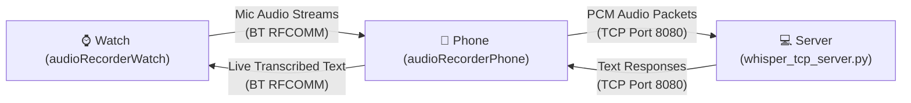

# Audio Recording and Forwarding

A demo system for real-time capturing, transcribing, and relaying audio between an Android smart watch, an Android phone, and a backend transcription server.

This repository consists of three main components arranged in a microservices-like architecture.

## Components

### 1. `audioRecorderWatch` (Wear OS App)
An Android application designed for smart watches (Wear OS).
- Records audio input from the watch's microphone.
- Connects to the companion phone app via a Bluetooth RFCOMM connection.
- Streams the raw audio in real-time to the phone.
- Receives the final transcribed text back from the phone and displays it dynamically on the watch UI.

### 2. `audioRecorderPhone` (Android Companion App)
An Android companion application that acts as the network relay and connection manager.
- Implements a clean MVVM (Model-View-ViewModel) architecture.
- Runs a Foreground Service to maintain active connections, allowing persistent background streaming even when the app is closed.
- Receives the continuous Bluetooth audio stream from the watch.
- Forwards the audio over a TCP connection to the backend Python server.
- Listens for transcribed text from the server and relays it back down to the watch.

### 3. `server` (Python TCP Whisper Server)
A Python-based backend server using `whisper.cpp` for fast, local, machine-learning-powered speech-to-text transcription.
- Operates a multithreaded TCP server (`whisper_tcp_server.py`) to receive incoming 16kHz PCM audio streams.
- Buffers and batches incoming audio into configurable overlapping windows.
- Automatically processes the audio using the `whisper.cpp` CLI to generate transcriptions.
- Filters out empty speech (like `[BLANK_AUDIO]`) to keep the UI clean.
- Returns the transcribed text over the TCP socket as soon as it is generated.

## Architecture Data Flow



## Setup & Running

1. **Backend Server (`server/`)**: 
   - Change directory into the `server/` folder.
   - Start the TCP server: 
     ```bash
     python whisper_tcp_server.py
     ```
   - The server will start listening on port `8080` and using the ggml-tiny.en.bin model by default.

2. **Phone Relay App (`audioRecorderPhone/`)**:
   - Open the `audioRecorderPhone` directory in Android Studio.
   - Build and deploy the application to your primary Android phone.
   - Ensure your watch and phone are paired and connected via Bluetooth.
   - Open the app, configure the server IP address if needed, and hit the start button to launch the Foreground Service.

3. **Watch Client App (`audioRecorderWatch/`)**:
   - Open the `audioRecorderWatch` directory in Android Studio.
   - Build and deploy the application to your Wear OS device.
   - Tap "Connect" button to connect to phone.
   - Tap "Start Recording" button to start recording and streaming audio to the server.
   - The audio will now flow continuously from your wrist to the server, and text will stream back in real-time!